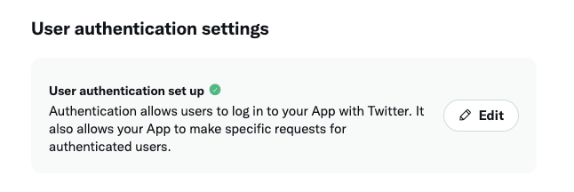
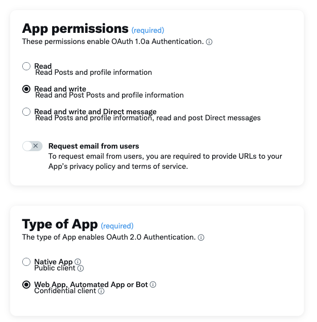
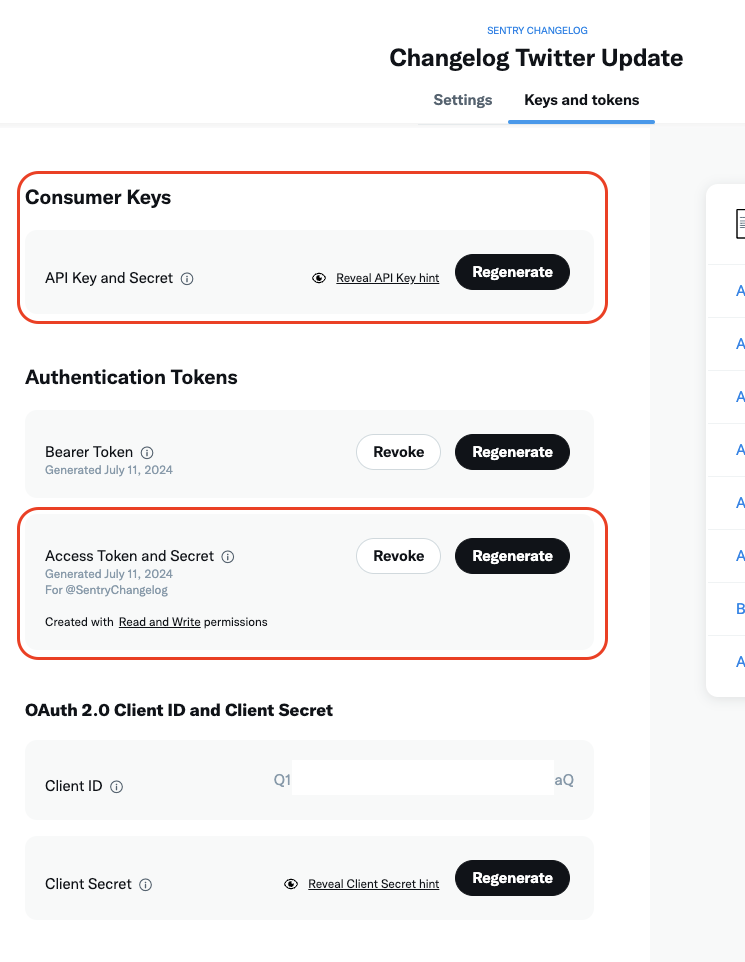
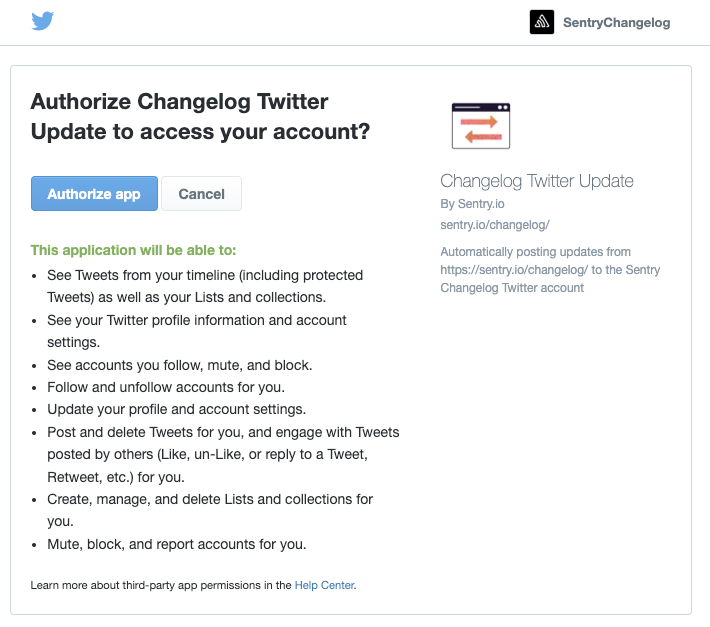

# changelog-twitter-poster
 
This is a GCP Cloud Function that listen to [Sentry Changelog](https://sentry.io/changelog/) and post the update on the [Sentry Changelog Twitter Account](https://x.com/SentryChangelog)

# How it works

This repo defines the infrasturtre and required components for a GCP cloud functions that listens to webhooks and post the data to Twitter. The intention is to update our Changelog Twitter account with updates that are posted to [Sentry Changelog](https://sentry.io/changelog/). 

We utilize Zapier as a RSS feed to webhook middleman, we have a simple Zapier app that subscribes to the [Changelog Feed](https://sentry.io/changelog/feed.xml) and send the feed data to the Cloud Function webhook, once the cloud function valid the request, it will then post the data to the Twitter account.

# Setup

## GCP
The infrasturce lives in the `changelog-twitter-poster` GCP project, you can deploy the infrasturce using terraform.

```
cd terraform
terraform init
terraform plan
terraform apply
```
Once the infra is deployed, you will need to update the following secrets in GCP Secret Manager.
```
sentrychangelog_twitter_consumer_key
sentrychangelog_twitter_consumer_secret
sentrychangelog_twitter_access_token
sentrychangelog_twitter_access_token_secret
sentrychangelog_webhook_auth_header
```
The twitter ones can be retrieved in the Twitter section below.

`sentrychangelog_webhook_auth_header` is a preshared secret that's setup in Zapier's webhook as a `Authorization` header to authorize the webhooks requests.

## Twitter

> Free version of Twitter API access is sufficiant for this integration.

You can visit [Twitter Developer Portal](https://developer.twitter.com/en/portal/projects-and-apps) to create a Free App for your Twitter account.

Once the app is created, edit the `User authentication settings`


Update the `App permissions` to `Read and write`, select `Web App, Automated App or Bot` as Type of App


For the App info, you can enter any URI for the required field, as we won't need them in the future. Don't forget to click save when you are done.

Next, go to the `Keys and tokens` tab, can create the Key/Secret pair for both `Consumer Keys` and `Acess Token and Secret`.


These are the keys that need to be added to the GCP secret manager, please handle them securely as anyone who has access to these keys will have access to your Twitter account.

Before these key has actual access to your Twitter account, we need to go through the OAuth flow. You can use the [sample code provided by Twitter](https://github.com/xdevplatform/Twitter-API-v2-sample-code/blob/main/Manage-Tweets/create_tweet.py), remember to set the environment variables as the consumer key and secret we generated in the last step. 

While running the script, you will be asked to visit an OAuth URL and authorize the app's access to your account. After authorizing, the script will try to post a "Hello world" twitter to your account, you can use this to verify the authorization is completed successfully.


Once this is completed, update the secrets in GCP and you should be good to go!
